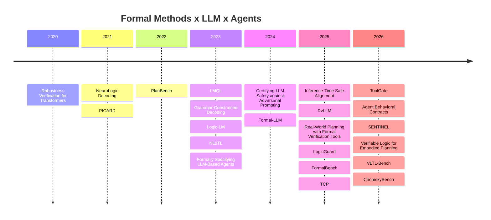

# Awesome Formal Methods for LLMs and Agents

面向大语言模型与智能体的形式化方法论文、工具、应用与基准清单。

This repository tracks work that brings **formal specification, verification, runtime monitoring, temporal logic, contracts, automata, constrained decoding, symbolic solving, and program semantics** into LLM and agent systems.

## Contents

- [Research Map](#research-map)
- [Quick Navigation](#quick-navigation)
- [Papers by Venue and Year](#papers-by-venue-and-year)
- [Theory](#theory)
- [Tools and Frameworks](#tools-and-frameworks)
- [Applications and Case Studies](#applications-and-case-studies)
- [Benchmarks and Evaluations](#benchmarks-and-evaluations)
- [Open Problems](#open-problems)
- [Curation Criteria](#curation-criteria)

Additional pages:

- [Papers by Topic](papers-by-topic.md)
- [Resources](resources.md)

## Research Map

Formal methods are entering LLM and agent systems through four main routes. **Theory** studies what can be certified about transformer robustness, inference-time safety, alignment boundaries, and model behavior. **Tools and Frameworks** integrate grammars, automata, query languages, runtime verification, Hoare-style contracts, and solvers into generation or execution. **Applications and Case Studies** focus on planning, tool use, embodied safety, agent protocols, and multi-step decision pipelines. **Benchmarks and Evaluations** use temporal logic, formal language hierarchies, program semantics, and constraint-based planning to characterize model and agent capability boundaries.

## Quick Navigation

| If you are interested in... | Start with |
|---|---|
| Transformer or LLM verification | [Robustness Verification for Transformers](https://arxiv.org/abs/2002.06622), [Towards Formally Verifying LLMs](https://openreview.net/forum?id=evDSvZBFRP) |
| Safe inference and guardrails | [On Almost Surely Safe Alignment of Large Language Models at Inference-Time](https://arxiv.org/abs/2502.01208), [Certifying LLM Safety against Adversarial Prompting](https://openreview.net/forum?id=wNere1lelo) |
| Contracts for tools and agents | [ToolGate](https://arxiv.org/abs/2601.04688), [Agent Behavioral Contracts](https://arxiv.org/abs/2602.22302) |
| Structured generation and constrained decoding | [LMQL](https://arxiv.org/abs/2212.06094), [Grammar-Constrained Decoding](https://aclanthology.org/2023.emnlp-main.674/), [NeuroLogic Decoding](https://aclanthology.org/2021.naacl-main.339/) |
| Temporal logic and runtime monitoring | [RvLLM](https://openreview.net/forum?id=XdwPWKbxd9&noteId=ZzUTHYqdwG), [Formally Specifying the High-Level Behavior of LLM-Based Agents](https://arxiv.org/abs/2310.08535), [LogicGuard](https://arxiv.org/abs/2507.03293) |
| Planning and embodied agents | [Large Language Models Can Solve Real-World Planning Rigorously with Formal Verification Tools](https://aclanthology.org/2025.naacl-long.176/), [SENTINEL](https://openreview.net/forum?id=vCyxemIKLL), [Grounding Generative Planners in Verifiable Logic](https://openreview.net/forum?id=wb05ver1k8) |
| Formal reasoning benchmarks | [FormalBench](https://aclanthology.org/2025.acl-long.1068/), [ChomskyBench](https://arxiv.org/abs/2604.02709), [VLTL-Bench](https://openreview.net/forum?id=RUs4KC34yT), [PlanBench](https://arxiv.org/abs/2206.10498) |

## Papers by Venue and Year

| Year | Venue / Status | Representative Papers |
|---:|---|---|
| 2026 | arXiv / OpenReview submission | [ToolGate](https://arxiv.org/abs/2601.04688), [Agent Behavioral Contracts](https://arxiv.org/abs/2602.22302), [ChomskyBench](https://arxiv.org/abs/2604.02709), [VLTL-Bench](https://openreview.net/forum?id=RUs4KC34yT), [SENTINEL](https://openreview.net/forum?id=vCyxemIKLL), [Grounding Generative Planners in Verifiable Logic](https://openreview.net/forum?id=wb05ver1k8) |
| 2025 | ACL / EMNLP / NAACL | [FormalBench](https://aclanthology.org/2025.acl-long.1068/), [TCP](https://aclanthology.org/2025.emnlp-main.1142.pdf), [Real-World Planning with Formal Verification Tools](https://aclanthology.org/2025.naacl-long.176/) |
| 2025 | arXiv / OpenReview submission | [Inference-Time Safe Alignment](https://arxiv.org/abs/2502.01208), [Towards Formally Verifying LLMs](https://openreview.net/forum?id=evDSvZBFRP), [RvLLM](https://openreview.net/forum?id=XdwPWKbxd9&noteId=ZzUTHYqdwG), [LogicGuard](https://arxiv.org/abs/2507.03293) |
| 2024 | arXiv / OpenReview | [Formal-LLM](https://arxiv.org/abs/2402.00798), [Certifying LLM Safety against Adversarial Prompting](https://openreview.net/forum?id=wNere1lelo), [Automata-based Constraints for Language Model Decoding](https://arxiv.org/abs/2407.08103) |
| 2023 | PLDI / EMNLP / arXiv | [LMQL](https://arxiv.org/abs/2212.06094), [Grammar-Constrained Decoding](https://aclanthology.org/2023.emnlp-main.674/), [Logic-LM](https://aclanthology.org/2023.findings-emnlp.248/), [NL2TL](https://arxiv.org/abs/2305.07766), [Formally Specifying LLM-Based Agents](https://arxiv.org/abs/2310.08535) |
| 2022 | arXiv / EMNLP | [PlanBench](https://arxiv.org/abs/2206.10498), [Constrained Language Models Yield Few-Shot Semantic Parsers](https://aclanthology.org/2022.emnlp-main.608/) |
| 2021 | NAACL / EMNLP | [NeuroLogic Decoding](https://aclanthology.org/2021.naacl-main.339/), [PICARD](https://aclanthology.org/2021.emnlp-main.779/) |
| 2020 | ICLR | [Robustness Verification for Transformers](https://arxiv.org/abs/2002.06622) |

## Theory

Theory papers ask what can be proved about transformers, LLM behavior, inference-time safety, alignment boundaries, and neural network verification foundations.

### Core Papers

| Title | Authors | Year | Category | Venue / Status | Summary | Contributions | Links |
|---|---|---:|---|---|---|---|---|
| [Agent Behavioral Contracts: Formal Specification and Runtime Enforcement for Reliable Autonomous AI Agents](https://arxiv.org/abs/2602.22302) | Varun Pratap Bhardwaj | 2026 | Theory | arXiv 2026, Preprint | 提出面向自治 agent 的行为契约框架，把前置条件、执行不变量、治理策略与恢复机制写成一等公民。 论文显式建模 LLM 非确定性下的契约满足语义，并讨论多 agent 组合时的可靠性传播。 该工作代表了从 prompt 约束走向系统契约语义的重要一步。 | - 将 Design-by-Contract 引入 agent - 定义非确定性下的契约满足条件 - 讨论组合与恢复机制 - 适合多 agent 与长链条工作流 | [arXiv](https://arxiv.org/abs/2602.22302) DOI: [10.48550/arXiv.2602.22302](https://doi.org/10.48550/arXiv.2602.22302) |
| [On Almost Surely Safe Alignment of Large Language Models at Inference-Time](https://arxiv.org/abs/2502.01208) | Xiaotong Ji et al. | 2025 | Theory | arXiv 2025, Preprint | 将推理时对齐形式化为带安全状态的约束过程，不依赖重新训练模型参数，而是在 inference-time 施加控制。 论文提出 InferenceGuard，并尝试给出“几乎必然安全”的理论保证。 它的重要意义在于说明 alignment 不一定只能在 RLHF 或微调阶段讨论。 | - 将 inference-time alignment 形式化 - 引入安全状态与约束控制 - 提出无需改权重的 InferenceGuard - 连接安全控制与形式保证 | [arXiv](https://arxiv.org/abs/2502.01208) DOI: [10.48550/arXiv.2502.01208](https://doi.org/10.48550/arXiv.2502.01208) |
| [Towards Formally Verifying LLMs: Taming the Nonlinearity of the Transformer](https://openreview.net/forum?id=evDSvZBFRP) | Tobias Ladner, Ahmed Rayen Mhadhbi, Matthias Althoff | 2025 | Theory | OpenReview 2025, OpenReview submission | 论文面向 transformer/LLM 本体验证，指出 softmax 与 attention 结构带来的强非线性是当前验证方法难以扩展的关键原因。 作者提出面向 transformer 的集合传播思路，以更好地处理非凸性并缓解过松的凸松弛。 这是少数真正把 formal verification of the backbone 作为主目标的工作。 | - 直接瞄准 transformer 非线性验证 - 改善 softmax/attention 的保守松弛 - 面向大模型验证扩展性问题 - 强化 LLM 验证基础工具链 | [OpenReview](https://openreview.net/forum?id=evDSvZBFRP) |
| [Certifying LLM Safety against Adversarial Prompting](https://openreview.net/forum?id=wNere1lelo) | Aounon Kumar et al. | 2024 | Theory | OpenReview 2024, Preprint | 这篇工作把 LLM 安全防护中的 prompt attack 问题转化为可认证安全问题。 作者提出 erase-and-check 思路，对扰动后的 prompt 家族给出形式化保障，而不只是经验性防御。 其贡献在于把越狱防御推进到 certification 语境。 | - 面向 adversarial prompting 的形式证书 - 针对删改、插入等攻击模式建模 - 将安全过滤从启发式推进到可证明层面 - 对 guardrail 设计有直接启发 | [OpenReview](https://openreview.net/forum?id=wNere1lelo) |
| [Robustness Verification for Transformers](https://arxiv.org/abs/2002.06622) | Zhouxing Shi, Huan Zhang, Kai-Wei Chang, Minlie Huang, Cho-Jui Hsieh | 2020 | Theory | ICLR 2020 | 这是 transformer 形式化鲁棒性验证的奠基性工作之一，系统处理 self-attention 带来的跨位置依赖与非线性耦合。 论文提出适配 transformer 的验证算法，并给出比朴素区间传播更强的保证。 虽然研究对象早于现代 LLM，但它构成 today’s LLM verification 的直接技术前史。 | - 较早系统化 transformer 验证 - 处理 self-attention 依赖结构 - 提供可认证鲁棒性界 - 是 LLM backbone 验证的重要起点 | [arXiv](https://arxiv.org/abs/2002.06622) [OpenReview](https://openreview.net/forum?id=BJxwPJHFwS) |

### Further Reading

- [Beyond Red-Teaming: Formal Guarantees of LLM Guardrail Classifiers](https://arxiv.org/abs/2605.10901)
- [Trust or Escalate: LLM Judges with Provable Guarantees for Human Agreement](https://openreview.net/forum?id=UHPnqSTBPO)
- [Vertex-Softmax: Tight Transformer Verification via Exact Softmax Objective Optimization](https://arxiv.org/abs/2605.10974)
- [On the Formal Limits of Alignment Verification](https://arxiv.org/abs/2603.08761)
- [Fast and Precise Certification of Transformers](https://dl.acm.org/doi/10.1145/3453483.3454056)
- [Reluplex: An Efficient SMT Solver for Verifying Deep Neural Networks](https://link.springer.com/chapter/10.1007/978-3-319-63387-9_42)
- [Marabou: A Framework for Verification and Analysis of Deep Neural Networks](https://link.springer.com/chapter/10.1007/978-3-030-25540-4_26)
- [A Survey of Neural Network Verification Methods](https://arxiv.org/abs/1810.01989)
- [An Abstract Domain for Certifying Neural Networks](https://dl.acm.org/doi/10.1145/3290382)
- [CROWN: A General Framework for Certifying and Boosting the Robustness of Neural Networks](https://arxiv.org/abs/1811.00866)
- [Beta-CROWN: Efficient Bound Propagation with Per-neuron Split Constraints for Complete and Incomplete Neural Network Verification](https://arxiv.org/abs/2103.06624)
- [VNN-COMP: Annual Verification of Neural Networks Competition](https://sites.google.com/view/vnn2024)

## Tools and Frameworks

Tools and frameworks embed formal structure into LLM and agent workflows, including grammar-constrained decoding, declarative query languages, automata, runtime verification, tool contracts, and solver-augmented reasoning.

### Core Papers

| Title | Authors | Year | Category | Venue / Status | Summary | Contributions | Links |
|---|---|---:|---|---|---|---|---|
| [ToolGate: Contract-Grounded and Verified Tool Execution for LLMs](https://arxiv.org/abs/2601.04688) | Yanming Liu et al. | 2026 | Tools / Frameworks | arXiv 2026, Preprint | ToolGate 面向 tool-augmented LLM，把工具调用过程写成带前置条件与后置条件的 Hoare-style contracts。 系统维护显式 symbolic state，仅接受通过契约校验的工具执行结果，从而降低虚假工具反馈污染状态的问题。 这是一条非常典型的把形式化验证放在 agent 接口层的路线。 | - 工具调用契约化 - 引入显式符号状态 - 防止 hallucinated tool results 进入可信状态 - 适配 agent tool-use pipeline | [arXiv](https://arxiv.org/abs/2601.04688) DOI: [10.48550/arXiv.2601.04688](https://doi.org/10.48550/arXiv.2601.04688) |
| [RvLLM: LLM Runtime Verification with Domain Knowledge](https://openreview.net/forum?id=XdwPWKbxd9&noteId=ZzUTHYqdwG) | Yedi Zhang et al. | 2025 | Tools / Frameworks | OpenReview 2025, OpenReview submission | RvLLM 从 runtime verification 角度出发，设计面向领域专家的轻量规范语言 ESL。 其核心思想不是让 LLM 自由发挥，而是在运行时对领域规则进行解释、监控与校验。 适合金融、医疗、工业控制等对领域知识一致性要求高的场景。 | - 设计轻量规范语言 ESL - 结合上下文解释与运行时推理 - 突出 domain knowledge 的显式注入 - 面向高风险应用场景 | [OpenReview](https://openreview.net/forum?id=XdwPWKbxd9&noteId=ZzUTHYqdwG) |
| [Formal-LLM: Integrating Formal Language and Natural Language for Controllable LLM-based Agents](https://arxiv.org/abs/2402.00798) | Zelong Li, Wenyue Hua, Hao Wang, He Zhu, Yongfeng Zhang | 2024 | Tools / Frameworks | arXiv 2024, Preprint | Formal-LLM 将用户目标与约束表达为 automaton，并在 automaton 的监督下生成和执行 plan。 它说明 formal language 并非只能用于后验检查，而可以在生成阶段就约束 agent 的控制流。 论文在规划与执行任务中展示了对 controllability 与有效性的明显改进。 | - 用 automata 表达自然语言约束 - 在 plan generation 过程中施加形式控制 - 降低不可执行与无效计划 - 兼顾可控性与任务完成率 | [arXiv](https://arxiv.org/abs/2402.00798) [Code](https://github.com/agiresearch/Formal-LLM) |
| [Prompting Is Programming: A Query Language for Large Language Models](https://arxiv.org/abs/2212.06094) | Luca Beurer-Kellner, Marc Fischer, Martin Vechev | 2023 | Tools / Frameworks | PLDI 2023 | LMQL 把 prompt 从自由文本提升为可编排、可约束的 query program。 用户可以将变量、控制流与输出约束写成程序语句，再由系统高效编译执行。 这项工作广泛影响了后续的 structured generation、guardrails 与可控解码框架。 | - 提出 Language Model Programming 范式 - 将约束直接写入生成逻辑 - 支持更高效的可控推理 - 连接 PL 语言思想与 LLM 调用 | [arXiv](https://arxiv.org/abs/2212.06094) DOI: [10.1145/3591300](https://doi.org/10.1145/3591300) [Code](https://github.com/eth-sri/lmql) |
| [Grammar-Constrained Decoding for Structured NLP Tasks without Finetuning](https://aclanthology.org/2023.emnlp-main.674/) | Saibo Geng, Martin Josifoski, Maxime Peyrard, Robert West | 2023 | Tools / Frameworks | EMNLP 2023 | 论文将大量 structured NLP 任务统一表述为 formal grammar decoding 问题。 通过 grammar-constrained decoding，模型输出天然满足指定结构；通过 input-dependent grammar，又把约束动态绑定到输入实例。 这是 LLM 结构化输出与形式语言约束结合的代表性工作。 | - 将结构任务统一为 grammar 约束问题 - 提出 input-dependent grammars - 无需 finetuning 即保证结构合法 - 对 IE、解析、结构抽取都具通用性 | [ACL Anthology](https://aclanthology.org/2023.emnlp-main.674/) DOI: [10.18653/v1/2023.emnlp-main.674](https://doi.org/10.18653/v1/2023.emnlp-main.674) |

### Further Reading

- [Logic-LM: Empowering Large Language Models with Symbolic Solvers for Faithful Logical Reasoning](https://aclanthology.org/2023.findings-emnlp.248/)
- [NL2TL: Transforming Natural Languages to Temporal Logics using Large Language Models](https://arxiv.org/abs/2305.07766)
- [Automatic Generation of Safety-compliant Linear Temporal Logic via Large Language Model: A Self-supervised Framework](https://openreview.net/forum?id=fp51nxr5B1)
- [Logically Constrained Decoding](https://aclanthology.org/2025.mathnlp-main.11/)
- [Flexible and Efficient Grammar-Constrained Decoding](https://arxiv.org/abs/2502.05111)
- [Automata-based Constraints for Language Model Decoding](https://arxiv.org/abs/2407.08103)
- [NeuroLogic Decoding: (Un)supervised Neural Text Generation with Predicate Logic Constraints](https://aclanthology.org/2021.naacl-main.339/)
- [PICARD: Parsing Incrementally for Constrained Auto-Regressive Decoding from Language Models](https://aclanthology.org/2021.emnlp-main.779/)
- [Constrained Language Models Yield Few-Shot Semantic Parsers](https://aclanthology.org/2022.emnlp-main.608/)
- [SGLang: Efficient Execution of Structured Language Model Programs](https://arxiv.org/abs/2312.07104)
- [DSPy: Compiling Declarative Language Model Calls into Self-Improving Pipelines](https://arxiv.org/abs/2310.03714)
- [Outlines](https://github.com/dottxt-ai/outlines)
- [Guidance](https://github.com/guidance-ai/guidance)
- [jsonformer](https://github.com/1rgs/jsonformer)

## Applications and Case Studies

Application papers study whether formal methods improve agent behavior in planning, tool invocation, embodied safety, multi-agent protocols, and long-horizon decision pipelines.

### Core Papers

| Title | Authors | Year | Category | Venue / Status | Summary | Contributions | Links |
|---|---|---:|---|---|---|---|---|
| [Grounding Generative Planners in Verifiable Logic: A Hybrid Architecture for Trustworthy Embodied AI](https://openreview.net/forum?id=wb05ver1k8) | Feiyu Wu et al. | 2026 | Applications | OpenReview 2026, OpenReview submission | 该工作提出 hybrid neuro-symbolic 架构，把 formal verifier 置于生成式 planner 的环内，而不是在生成完成后简单打分。 LLM 负责高层生成，逻辑验证器负责约束安全性与可执行性，从而提升 embodied planning 的可信度。 这类设计体现了生成与验证闭环的应用潜力。 | - verifier 进入 planning loop - 面向 embodied AI 的生成式规划 - 用 verifiable logic 约束 plan 安全性 - 体现 neuro-symbolic 混合范式 | [OpenReview](https://openreview.net/forum?id=wb05ver1k8) |
| [SENTINEL: A Multi-Level Formal Framework for Safety Evaluation of LLM-based Embodied Agents](https://openreview.net/forum?id=vCyxemIKLL) | Simon Sinong Zhan et al. | 2026 | Applications | OpenReview 2026, OpenReview submission | SENTINEL 针对 embodied LLM agents 的物理安全问题，提出多层级 formal safety framework。 论文将 safety requirements grounding 成 temporal logic constraints，并在决策不同阶段进行检查。 它把任务完成与轨迹安全清晰地区分开来。 | - 面向 embodied agent 的形式安全语义 - 将物理安全表达为时序约束 - 分层评估决策过程 - 适合机器人与交互环境评测 | [OpenReview](https://openreview.net/forum?id=vCyxemIKLL) |
| [LogicGuard: Improving Embodied LLM Agents through Temporal Logic Based Critics](https://arxiv.org/abs/2507.03293) | Anand Gokhale, Vaibhav Srivastava, Francesco Bullo | 2025 | Applications | arXiv 2025, Preprint | LogicGuard 构造 actor-critic 风格的 embodied LLM agent，其中 critic 不输出自由文本，而输出 LTL 约束。 这使得反馈本身就可被解释为形式规范，从而对 actor 的行为进行更稳定的引导。 该思路对长期交互与安全约束场景尤其有价值。 | - 用 temporal logic 替代自由文本 critic - actor-critic 与形式规范结合 - 强化安全与效率的联合优化 - 适配 embodied 任务与图规划 | [arXiv](https://arxiv.org/abs/2507.03293) |
| [Large Language Models Can Solve Real-World Planning Rigorously with Formal Verification Tools](https://aclanthology.org/2025.naacl-long.176/) | Yilun Hao, Yongchao Chen, Yang Zhang, Chuchu Fan | 2025 | Applications | NAACL 2025 | 论文把现实世界规划问题转化为形式约束满足问题，由 LLM 负责将自然语言需求翻译成 solver 可处理的结构化表示。 真正的正确性与完备性由 formal verification / solving 工具承担，而不是由 LLM 直觉保证。 这是工程上最强可迁移性的路线之一。 | - LLM 负责 formalization，solver 负责 correctness - 面向真实规划而非纯 toy task - 展示语言到约束的实用 pipeline - 适合对接 SMT/SAT/优化器 | [ACL Anthology](https://aclanthology.org/2025.naacl-long.176/) |
| [Formally Specifying the High-Level Behavior of LLM-Based Agents](https://arxiv.org/abs/2310.08535) | Maxwell Crouse et al. | 2023 | Applications | arXiv 2023, Preprint | 这篇工作允许使用 LTL 等声明式规范来描述 agent 的高层行为，再通过受约束的 decoder/monitor 保障生成满足规范。 它的重要意义在于把 agent protocol 设计从 prompt engineering 提升到 formal specification 层。 对 ReAct、workflow agents 与 protocol agents 都有启发。 | - 为 agent 高层行为引入形式规范 - 声明式定义 agent protocol - 通过监控/约束生成保证满足规范 - 适合复用到 workflow 设计 | [arXiv](https://arxiv.org/abs/2310.08535) [Code](https://github.com/IBM/llm-agent-framework) |

### Further Reading

- [Formal-LLM: Integrating Formal Language and Natural Language for Controllable LLM-based Agents](https://arxiv.org/abs/2402.00798)
- [ToolGate: Contract-Grounded and Verified Tool Execution for LLMs](https://arxiv.org/abs/2601.04688)
- [RvLLM: LLM Runtime Verification with Domain Knowledge](https://openreview.net/forum?id=XdwPWKbxd9&noteId=ZzUTHYqdwG)
- [Agent Behavioral Contracts: Formal Specification and Runtime Enforcement for Reliable Autonomous AI Agents](https://arxiv.org/abs/2602.22302)
- [Logic-LM: Empowering Large Language Models with Symbolic Solvers for Faithful Logical Reasoning](https://aclanthology.org/2023.findings-emnlp.248/)
- [NL2TL: Transforming Natural Languages to Temporal Logics using Large Language Models](https://arxiv.org/abs/2305.07766)
- [Automatic Generation of Safety-compliant Linear Temporal Logic via Large Language Model: A Self-supervised Framework](https://openreview.net/forum?id=fp51nxr5B1)
- [Position: Trustworthy AI Agents Require the Integration of Large Language Models and Formal Methods](https://openreview.net/forum?id=wkisIZbntD)
- [SpecMAS: A Multi-Agent System for Self-Verifying System Generation via Formal Model Checking](https://github.com/Idsl-group/SpecMAS)

## Benchmarks and Evaluations

Benchmarks and evaluations measure whether LLMs and agents can actually handle formal reasoning, formal languages, program semantics, temporal constraints, and planning under structured constraints.

### Core Papers

| Title | Authors | Year | Category | Venue / Status | Summary | Contributions | Links |
|---|---|---:|---|---|---|---|---|
| [Evaluating the Formal Reasoning Capabilities of Large Language Models through Chomsky Hierarchy](https://arxiv.org/abs/2604.02709) | Yihong Dong et al. | 2026 | Benchmarks | arXiv 2026, Preprint | ChomskyBench 以 Chomsky Hierarchy 为主线评估 LLM 的 formal reasoning capability。 它覆盖从正规语言到更高层级形式语言的任务，并强调可确定性验证与过程评估。 这类 benchmark 的优势在于理论结构清晰、难度层级明确。 | - 用形式语言层级刻画能力边界 - 覆盖多级 formal language 任务 - 支持过程化评估 - 适合比较规则掌握与泛化能力 | [arXiv](https://arxiv.org/abs/2604.02709) |
| [Verifiable Natural Language to Linear Temporal Logic Translation: A Benchmark Dataset and Evaluation Suite](https://openreview.net/forum?id=RUs4KC34yT) | William H. English et al. | 2026 | Benchmarks | OpenReview 2026, OpenReview submission | VLTL-Bench 关注 NL-to-LTL 的完整流程，不只测翻译表面相似度，还测 grounding、trace-level verification 等环节。 相比仅凭字符串匹配的 benchmark，它更接近真实部署时的规范工程流程。 对 agent specification learning 极具价值。 | - 将 NL-to-LTL 分解为多阶段评估 - 引入 trace-based verification - 突出 grounding 难题 - 适合时序规范生成评测 | [OpenReview](https://openreview.net/forum?id=RUs4KC34yT) |
| [Can LLMs Reason About Program Semantics? A Comprehensive Evaluation of LLMs on Formal Specification Inference](https://aclanthology.org/2025.acl-long.1068/) | Thanh Le-Cong, Bach Le, Toby Murray | 2025 | Benchmarks | ACL 2025 | FormalBench 评估 LLM 是否真正理解程序语义，而不仅是表面代码模式。 任务核心是 formal specification inference，即从程序推断准确、完整的形式规范。 这使它成为程序语义、LLM 与 formal methods 交叉处非常关键的 benchmark。 | - 聚焦 program semantics 而非文本模式 - 引入 specification inference 任务 - 强调 correctness 与 completeness - 适合软件验证和 code agents | [ACL Anthology](https://aclanthology.org/2025.acl-long.1068/) |
| [TCP: a Benchmark for Temporal Constraint-Based Planning](https://aclanthology.org/2025.emnlp-main.1142.pdf) | Zifeng Ding et al. | 2025 | Benchmarks | EMNLP 2025 | TCP 将 temporal reasoning 与 planning 结合起来评估，而不是把时间推理做成孤立的问答任务。 基准中的自然对话包含显式和隐式时间约束，模型需要生成满足全部约束的方案。 这非常贴近真实 agent 场景中的协同日程与任务管理。 | - 联合评测时间推理与规划 - 使用自然场景约束表达 - 暴露 LLM 在复杂时序规划上的短板 - 对 assistant/agent scheduling 场景直接相关 | [ACL Anthology PDF](https://aclanthology.org/2025.emnlp-main.1142.pdf) |
| [PlanBench: An Extensible Benchmark for Evaluating Large Language Models on Planning and Reasoning about Change](https://arxiv.org/abs/2206.10498) | Karthik Valmeekam et al. | 2022 | Benchmarks | arXiv 2022, Preprint | PlanBench 将 automated planning 社区的结构化状态转移问题引入 LLM 评测。 它避免了很多靠语料记忆答题的假象，更关注 planning state、action preconditions 与 change reasoning。 是形式化规划与 LLM 基准对接的早期关键工作。 | - 引入结构化 planning domain 评测 - 对 reasoning about change 更敏感 - 适合与 PDDL/经典规划对接 - 是后续 agent planning 研究的重要基线 | [arXiv](https://arxiv.org/abs/2206.10498) |

### Further Reading

- [A Benchmark for Evaluating LLMs on Temporal Reasoning](https://openreview.net/forum?id=44CoQe6VCq)
- [OuLiBench: Formal Constraints as a Lens to Study Controlled Generation in Italian LLMs](https://aclanthology.org/2025.clicit-1.14.pdf)
- [TIMERES: A Turkish Benchmark For Evaluating Temporal Reasoning in LLMs](https://aclanthology.org/2026.eacl-srw.67.pdf)
- [Benchmarking Multilingual Temporal Reasoning in LLMs](https://aclanthology.org/2026.iwsds-1.19.pdf)
- [ProofWriter](https://allenai.org/data/proofwriter)
- [FOLIO: Natural Language Reasoning with First-Order Logic](https://github.com/Yale-LILY/FOLIO)
- [BIG-Bench Hard](https://arxiv.org/abs/2210.09261)
- [TravelPlanner](https://github.com/OSU-NLP-Group/TravelPlanner)
- [ALFWorld](https://alfworld.github.io/)
- [BEHAVIOR](https://behavior.stanford.edu/)
- [WebArena](https://webarena.dev/)
- [AgentBench](https://arxiv.org/abs/2308.03688)

## Open Problems

- **End-to-end verifiable semantics for LLM systems.** Most current methods verify an interface, decoder, tool layer, or runtime trace rather than the full semantics of a foundation-model-backed system.
- **Grounding natural language into formal specifications.** NL-to-LTL, automata, contracts, and program specs often look plausible at sentence level but degrade when object binding, state grounding, and trace semantics matter.
- **Compositional verification for multi-agent systems.** Multi-agent failures often arise from shared state, resource contention, protocol mismatch, and unclear responsibility propagation.
- **Runtime verification under partial observability.** Real agents usually operate with incomplete state, delayed feedback, external memory, retrieval noise, and changing environments.
- **Verified tool-use semantics.** Tool calls involve external APIs, permissions, side effects, non-deterministic responses, and time-varying resources; these need a stronger common abstraction.
- **Unified benchmarks for specification, planning, execution, monitoring, and recovery.** Existing benchmarks are still split across formal language, temporal logic, program semantics, planning, and embodied safety.
- **Efficient proof-carrying generation.** A promising direction is to make LLMs output machine-checkable witnesses, proof objects, trace certificates, or contract-satisfaction records.

## Curation Criteria

This list prioritizes work with a clear connection between LLMs or agents and at least one formal-methods mechanism: formal specification, model checking, theorem proving, temporal logic, contracts, automata, grammars, constrained decoding, runtime verification, symbolic solving, program semantics, certified robustness, or verifiable planning.

Preferred sources are conference and journal pages, ACL Anthology, OpenReview, arXiv, project pages, author repositories, and official DOI records. Preprints and OpenReview submissions are marked explicitly when a formal publication venue is not confirmed.
