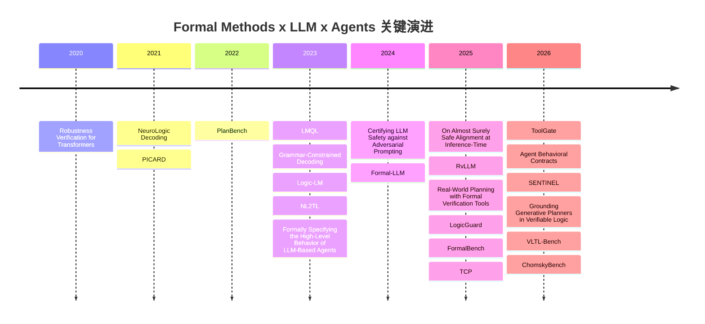
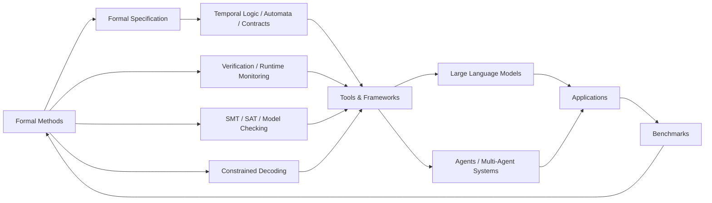

# Awesome Formal Methods for LLMs and Agents

> **仓库后缀建议**：`awesome-formal-llm-agents`  
> **中文副标题**：面向大语言模型与智能体的形式化方法论文、工具、应用与基准清单  
> **建议文件名**：`awesome-formal-methods-LLM-agent.md`

## 执行摘要

这份清单聚焦“形式化方法如何进入 LLM 与 agent 系统”，目标不是泛泛罗列“安全”“对齐”“推理”论文，而是优先筛选那些真正把 **formal specification、verification、runtime monitoring、temporal logic、contracts、automata、constrained decoding、symbolic solving** 引入 LLM 或 agent 工作流的研究。就现有文献看，这一方向已经从早期的 **Transformer 鲁棒性验证**，演进到 **推理时安全证书、结构约束生成、形式化高层行为规范、tool-use 契约验证、embodied safety 语义、formal reasoning benchmark** 等多个子方向。

如果只看最具实操价值的路线，当前研究大致形成四条主线。其一是 **Theory**，尝试对 transformer/LLM 的鲁棒性、安全对齐或输出边界给出可证明保证。其二是 **Tools/Frameworks**，把 grammar、automata、query language、运行时验证、Hoare-style contracts 等机制嵌入生成与执行流程。其三是 **Applications/Case Studies**，重点落在 planning、tool use、embodied safety、agent protocol design 等场景。其四是 **Benchmarks/Evaluations**，用 temporal logic、formal language hierarchy、program semantics 与 constraint-based planning 系统刻画 LLM 与 agent 的能力边界。

本文档遵循 awesome 仓库首页常见信息架构，适合直接作为 GitHub README 使用。核心论文按类别分节、按年份倒序给出，扩展阅读则尽量覆盖 2019-2026 年间与本主题高度相关的补充工作。对于尚未正式接收、仅存在于 arXiv 或 OpenReview 的工作，文中明确标注为 **Preprint** 或 **OpenReview submission**，避免把预印本误写成正式发表论文。

## 仓库定位与阅读方式

本仓库建议采用类似 `awesome-unified-embedding` 与 `Awesome-FL` 的首页风格，即：

- 首页先给出执行摘要与研究地图
- 每个类别先列 3-5 篇核心代表论文
- 再给出扩展阅读，便于继续追踪
- 统一提供标题链接、年份、类别、发表状态、摘要、贡献点、链接/DOI/代码仓库
- 对用户已有草稿中已出现的条目，标注 **来源：用户草稿**

本清单的四个一级类别如下：

- **理论 Theory**
- **工具/框架 Tools/Frameworks**
- **应用/案例 Applications/Case Studies**
- **评测/基准 Benchmarks/Evaluations**

## 时间线与关系图

## 理论 Theory

这一类关注 **“什么能被证明”**。它既包括直接面向 transformer/LLM 的可验证性与安全证书，也包括更底层的 neural network verification 基础，为后续 LLM 验证方法提供技术土壤。

### 核心代表论文

| 标题 | 作者 | 年份 | 类别 | 发表/提交地点与等级 | 3-4 行中文摘要 | 关键贡献点 | 链接/DOI/代码仓库 |
|---|---|---:|---|---|---|---|---|
| [Agent Behavioral Contracts: Formal Specification and Runtime Enforcement for Reliable Autonomous AI Agents](https://arxiv.org/abs/2602.22302) | Varun Pratap Bhardwaj | 2026 | 理论 | arXiv 2026, Preprint | 提出面向自治 agent 的行为契约框架，把前置条件、执行不变量、治理策略与恢复机制写成一等公民。 论文显式建模 LLM 非确定性下的契约满足语义，并讨论多 agent 组合时的可靠性传播。 该工作代表了从“prompt 约束”走向“系统契约语义”的重要一步。 | - 将 Design-by-Contract 引入 agent - 定义非确定性下的契约满足条件 - 讨论组合与恢复机制 - 适合多 agent 与长链条工作流 | [arXiv](https://arxiv.org/abs/2602.22302) DOI: [10.48550/arXiv.2602.22302](https://doi.org/10.48550/arXiv.2602.22302) 来源：用户草稿 |
| [On Almost Surely Safe Alignment of Large Language Models at Inference-Time](https://arxiv.org/abs/2502.01208) | Xiaotong Ji 等 | 2025 | 理论 | arXiv 2025, Preprint | 将推理时对齐形式化为带安全状态的约束过程，不依赖重新训练模型参数，而是在 inference-time 施加控制。 论文提出 InferenceGuard，并尝试给出“几乎必然安全”的理论保证。 它的重要意义在于说明，alignment 不一定只能在 RLHF 或微调阶段讨论。 | - 将 inference-time alignment 形式化 - 引入安全状态与约束控制 - 提出无需改权重的 InferenceGuard - 连接安全控制与形式保证 | [arXiv](https://arxiv.org/abs/2502.01208) DOI: [10.48550/arXiv.2502.01208](https://doi.org/10.48550/arXiv.2502.01208) 来源：用户草稿 |
| [Towards Formally Verifying LLMs: Taming the Nonlinearity of the Transformer](https://openreview.net/forum?id=evDSvZBFRP) | Tobias Ladner, Ahmed Rayen Mhadhbi, Matthias Althoff | 2025 | 理论 | OpenReview 2025, OpenReview submission | 论文面向 transformer/LLM 本体验证，指出 softmax 与 attention 结构带来的强非线性是当前验证方法难以扩展的关键原因。 作者提出面向 transformer 的集合传播思路，以更好地处理非凸性并缓解过松的凸松弛。 这是少数真正把“formal verification of the backbone”作为主目标的工作。 | - 直接瞄准 transformer 非线性验证 - 改善 softmax/attention 的保守松弛 - 面向大模型验证扩展性问题 - 强化 LLM 验证基础工具链 | [OpenReview](https://openreview.net/forum?id=evDSvZBFRP) DOI: 未公开/未知 来源：用户草稿 |
| [Certifying LLM Safety against Adversarial Prompting](https://openreview.net/forum?id=wNere1lelo) | Aounon Kumar 等 | 2024 | 理论 | OpenReview 2024, Preprint | 这篇工作把 LLM 安全防护中的 prompt attack 问题转化为可认证安全问题。 作者提出 erase-and-check 思路，对扰动后的 prompt 家族给出形式化保障，而不只是经验性防御。 其贡献在于把“越狱防御”推进到 certification 语境。 | - 面向 adversarial prompting 的形式证书 - 针对删改、插入等攻击模式建模 - 将安全过滤从启发式推进到可证明层面 - 对 guardrail 设计有直接启发 | [OpenReview](https://openreview.net/forum?id=wNere1lelo) DOI: 未公开/未知 来源：用户草稿 |
| [Robustness Verification for Transformers](https://arxiv.org/abs/2002.06622) | Zhouxing Shi, Huan Zhang, Kai-Wei Chang, Minlie Huang, Cho-Jui Hsieh | 2020 | 理论 | ICLR 2020, A* | 这是 transformer 形式化鲁棒性验证的奠基性工作之一，系统处理 self-attention 带来的跨位置依赖与非线性耦合。 论文提出适配 transformer 的验证算法，并给出比朴素区间传播更强的保证。 虽然研究对象早于现代 LLM，但它构成 today’s LLM verification 的直接技术前史。 | - 较早系统化 transformer 验证 - 处理 self-attention 依赖结构 - 提供可认证鲁棒性界 - 是 LLM backbone 验证的重要起点 | [arXiv](https://arxiv.org/abs/2002.06622) [OpenReview](https://openreview.net/forum?id=BJxwPJHFwS) DOI: 未公开/未知 来源：用户草稿 |

### 扩展阅读

以下条目按“高相关优先，必要时补充 neural network verification 基础”的原则给出：

- [Beyond Red-Teaming: Formal Guarantees of LLM Guardrail Classifiers](https://arxiv.org/abs/2605.10901)
- [Trust or Escalate: LLM Judges with Provable Guarantees for Human Agreement](https://openreview.net/forum?id=UHPnqSTBPO)
- [Vertex-Softmax: Tight Transformer Verification via Exact Softmax Objective Optimization](https://arxiv.org/abs/2605.10974)
- [On the Formal Limits of Alignment Verification](https://arxiv.org/abs/2603.08761)
- [Fast and Precise Certification of Transformers](https://dl.acm.org/doi/10.1145/3453483.3454056)
- [Reluplex: An Efficient SMT Solver for Verifying Deep Neural Networks](https://link.springer.com/chapter/10.1007/978-3-319-63387-9_42)
- [Marabou: A Framework for Verification and Analysis of Deep Neural Networks](https://link.springer.com/chapter/10.1007/978-3-030-25540-4_26)
- [A Survey of Neural Network Verification Methods](https://arxiv.org/abs/1810.01989)
- [An Abstract Domain for Certifying Neural Networks](https://dl.acm.org/doi/10.1145/3290382)
- [CROWN: A General Framework for Certifying and Boosting the Robustness of Neural Networks](https://arxiv.org/abs/1811.00866)
- [Beta-CROWN: Efficient Bound Propagation with Per-neuron Split Constraints for Complete and Incomplete Neural Network Verification](https://arxiv.org/abs/2103.06624)
- [VNN-COMP: Annual Verification of Neural Networks Competition](https://sites.google.com/view/vnn2024)

## 工具/框架 Tools/Frameworks

这一类关注 **“如何把形式化结构放进 LLM/agent 工作流”**。最典型的路线包括 grammar-constrained decoding、declarative query language、automata monitoring、runtime verification、tool contracts 与 solver-augmented reasoning。

### 核心代表论文

| 标题 | 作者 | 年份 | 类别 | 发表/提交地点与等级 | 3-4 行中文摘要 | 关键贡献点 | 链接/DOI/代码仓库 |
|---|---|---:|---|---|---|---|---|
| [ToolGate: Contract-Grounded and Verified Tool Execution for LLMs](https://arxiv.org/abs/2601.04688) | Yanming Liu 等 | 2026 | 工具/框架 | arXiv 2026, Preprint | ToolGate 面向 tool-augmented LLM，把工具调用过程写成带前置条件与后置条件的 Hoare-style contracts。 系统维护显式 symbolic state，仅接受通过契约校验的工具执行结果，从而降低虚假工具反馈污染状态的问题。 这是一条非常典型的“把形式化验证放在 agent 接口层”的路线。 | - 工具调用契约化 - 引入显式符号状态 - 防止 hallucinated tool results 进入可信状态 - 适配 agent tool-use pipeline | [arXiv](https://arxiv.org/abs/2601.04688) DOI: [10.48550/arXiv.2601.04688](https://doi.org/10.48550/arXiv.2601.04688) 来源：用户草稿 |
| [RvLLM: LLM Runtime Verification with Domain Knowledge](https://openreview.net/forum?id=XdwPWKbxd9&noteId=ZzUTHYqdwG) | Yedi Zhang 等 | 2025 | 工具/框架 | OpenReview 2025, OpenReview submission | RvLLM 从 runtime verification 角度出发，设计面向领域专家的轻量规范语言 ESL。 其核心思想不是让 LLM 自由发挥，而是在运行时对领域规则进行解释、监控与校验。 适合金融、医疗、工业控制等对领域知识一致性要求高的场景。 | - 设计轻量规范语言 ESL - 结合上下文解释与运行时推理 - 突出 domain knowledge 的显式注入 - 面向高风险应用场景 | [OpenReview](https://openreview.net/forum?id=XdwPWKbxd9&noteId=ZzUTHYqdwG) DOI: 未公开/未知 来源：用户草稿 |
| [Formal-LLM: Integrating Formal Language and Natural Language for Controllable LLM-based Agents](https://arxiv.org/abs/2402.00798) | Zelong Li, Wenyue Hua, Hao Wang, He Zhu, Yongfeng Zhang | 2024 | 工具/框架 | arXiv 2024, Preprint | Formal-LLM 将用户目标与约束表达为 automaton，并在 automaton 的监督下生成和执行 plan。 它说明 formal language 并非只能用于后验检查，而可以在生成阶段就约束 agent 的控制流。 论文在规划与执行任务中展示了对 controllability 与有效性的明显改进。 | - 用 automata 表达自然语言约束 - 在 plan generation 过程中施加形式控制 - 降低不可执行与无效计划 - 兼顾可控性与任务完成率 | [arXiv](https://arxiv.org/abs/2402.00798) [Code](https://github.com/agiresearch/Formal-LLM) DOI: 未公开/未知 来源：用户草稿 |
| [Prompting Is Programming: A Query Language for Large Language Models](https://arxiv.org/abs/2212.06094) | Luca Beurer-Kellner, Marc Fischer, Martin Vechev | 2023 | 工具/框架 | PLDI 2023, A* | LMQL 把 prompt 从自由文本提升为可编排、可约束的 query program。 用户可以将变量、控制流与输出约束写成程序语句，再由系统高效编译执行。 这项工作广泛影响了后续的 structured generation、guardrails 与可控解码框架。 | - 提出 Language Model Programming 范式 - 将约束直接写入生成逻辑 - 支持更高效的可控推理 - 连接 PL 语言思想与 LLM 调用 | [arXiv](https://arxiv.org/abs/2212.06094) DOI: [10.1145/3591300](https://doi.org/10.1145/3591300) [Code](https://github.com/eth-sri/lmql) 来源：用户草稿 |
| [Grammar-Constrained Decoding for Structured NLP Tasks without Finetuning](https://aclanthology.org/2023.emnlp-main.674/) | Saibo Geng, Martin Josifoski, Maxime Peyrard, Robert West | 2023 | 工具/框架 | EMNLP 2023, A* | 论文将大量 structured NLP 任务统一表述为 formal grammar decoding 问题。 通过 grammar-constrained decoding，模型输出天然满足指定结构；通过 input-dependent grammar，又把约束动态绑定到输入实例。 这是 LLM 结构化输出与形式语言约束结合的代表性工作。 | - 将结构任务统一为 grammar 约束问题 - 提出 input-dependent grammars - 无需 finetuning 即保证结构合法 - 对 IE、解析、结构抽取都具通用性 | [ACL Anthology](https://aclanthology.org/2023.emnlp-main.674/) DOI: [10.18653/v1/2023.emnlp-main.674](https://doi.org/10.18653/v1/2023.emnlp-main.674) 来源：用户草稿 |

### 扩展阅读

- [Logic-LM: Empowering Large Language Models with Symbolic Solvers for Faithful Logical Reasoning](https://aclanthology.org/2023.findings-emnlp.248/)
- [NL2TL: Transforming Natural Languages to Temporal Logics using Large Language Models](https://arxiv.org/abs/2305.07766)
- [Automatic Generation of Safety-compliant Linear Temporal Logic via Large Language Model: A Self-supervised Framework](https://openreview.net/forum?id=fp51nxr5B1)
- [Logically Constrained Decoding](https://aclanthology.org/2025.mathnlp-main.11/)
- [Flexible and Efficient Grammar-Constrained Decoding](https://arxiv.org/abs/2502.05111)
- [Automata-based Constraints for Language Model Decoding](https://arxiv.org/abs/2407.08103)
- [NeuroLogic Decoding: (Un)supervised Neural Text Generation with Predicate Logic Constraints](https://aclanthology.org/2021.naacl-main.339/)
- [PICARD: Parsing Incrementally for Constrained Auto-Regressive Decoding from Language Models](https://aclanthology.org/2021.emnlp-main.779/)
- [Constrained Language Models Yield Few-Shot Semantic Parsers](https://aclanthology.org/2022.emnlp-main.608/)
- [SGLang: Efficient Execution of Structured Language Model Programs](https://arxiv.org/abs/2312.07104)
- [DSPy: Compiling Declarative Language Model Calls into Self-Improving Pipelines](https://arxiv.org/abs/2310.03714)
- [Outlines](https://github.com/dottxt-ai/outlines)
- [Guidance](https://github.com/guidance-ai/guidance)
- [jsonformer](https://github.com/1rgs/jsonformer)

> 说明：本节扩展阅读中，最后 4 项为工程系统或框架项目而非标准论文，但在 GitHub 仓库首页中具有很高的实用参考价值，尤其适合“structured generation / constrained outputs / programmatic prompting”方向的工程实践者。

## 应用/案例 Applications/Case Studies

这一类关注 **“形式化方法是否真的改善 agent 行为”**。相比纯理论工作，它更强调 planning、tool invocation、embodied safety、multi-stage decision pipeline 等真实系统问题。

### 核心代表论文

| 标题 | 作者 | 年份 | 类别 | 发表/提交地点与等级 | 3-4 行中文摘要 | 关键贡献点 | 链接/DOI/代码仓库 |
|---|---|---:|---|---|---|---|---|
| [Grounding Generative Planners in Verifiable Logic: A Hybrid Architecture for Trustworthy Embodied AI](https://openreview.net/forum?id=wb05ver1k8) | Feiyu Wu 等 | 2026 | 应用/案例 | OpenReview 2026, OpenReview submission | 该工作提出 hybrid neuro-symbolic 架构，把 formal verifier 置于生成式 planner 的环内，而不是在生成完成后简单打分。 LLM 负责高层生成，逻辑验证器负责约束安全性与可执行性，从而提升 embodied planning 的可信度。 这类设计体现了“生成与验证闭环”的应用潜力。 | - verifier 进入 planning loop - 面向 embodied AI 的生成式规划 - 用 verifiable logic 约束 plan 安全性 - 体现 neuro-symbolic 混合范式 | [OpenReview](https://openreview.net/forum?id=wb05ver1k8) DOI: 未公开/未知 来源：用户草稿 |
| [SENTINEL: A Multi-Level Formal Framework for Safety Evaluation of LLM-based Embodied Agents](https://openreview.net/forum?id=vCyxemIKLL) | Simon Sinong Zhan 等 | 2026 | 应用/案例 | OpenReview 2026, OpenReview submission | SENTINEL 针对 embodied LLM agents 的物理安全问题，提出多层级 formal safety framework。 论文将 safety requirements grounding 成 temporal logic constraints，并在决策不同阶段进行检查。 它把“任务完成”与“轨迹安全”清晰地区分开来。 | - 面向 embodied agent 的形式安全语义 - 将物理安全表达为时序约束 - 分层评估决策过程 - 适合机器人与交互环境评测 | [OpenReview](https://openreview.net/forum?id=vCyxemIKLL) DOI: 未公开/未知 来源：用户草稿 |
| [LogicGuard: Improving Embodied LLM Agents through Temporal Logic Based Critics](https://arxiv.org/abs/2507.03293) | Anand Gokhale, Vaibhav Srivastava, Francesco Bullo | 2025 | 应用/案例 | arXiv 2025, Preprint | LogicGuard 构造 actor-critic 风格的 embodied LLM agent，其中 critic 不输出自由文本，而输出 LTL 约束。 这使得“反馈”本身就可被解释为形式规范，从而对 actor 的行为进行更稳定的引导。 该思路对长期交互与安全约束场景尤其有价值。 | - 用 temporal logic 替代自由文本 critic - actor-critic 与形式规范结合 - 强化安全与效率的联合优化 - 适配 embodied 任务与图规划 | [arXiv](https://arxiv.org/abs/2507.03293) DOI: 未公开/未知 来源：用户草稿 |
| [Large Language Models Can Solve Real-World Planning Rigorously with Formal Verification Tools](https://aclanthology.org/2025.naacl-long.176/) | Yilun Hao, Yongchao Chen, Yang Zhang, Chuchu Fan | 2025 | 应用/案例 | NAACL 2025, A | 论文把现实世界规划问题转化为形式约束满足问题，由 LLM 负责将自然语言需求翻译成 solver 可处理的结构化表示。 真正的正确性与完备性由 formal verification / solving 工具承担，而不是由 LLM 直觉保证。 这是工程上最强可迁移性的路线之一。 | - LLM 负责 formalization，solver 负责 correctness - 面向真实规划而非纯 toy task - 展示“语言到约束”的实用 pipeline - 适合对接 SMT/SAT/优化器 | [ACL Anthology](https://aclanthology.org/2025.naacl-long.176/) DOI: 未公开/未知 来源：用户草稿 |
| [Formally Specifying the High-Level Behavior of LLM-Based Agents](https://arxiv.org/abs/2310.08535) | Maxwell Crouse 等 | 2023 | 应用/案例 | arXiv 2023, Preprint | 这篇工作允许使用 LTL 等声明式规范来描述 agent 的高层行为，再通过受约束的 decoder/monitor 保障生成满足规范。 它的重要意义在于把 agent protocol 设计从 prompt engineering 提升到 formal specification 层。 对 ReAct、workflow agents 与 protocol agents 都有启发。 | - 为 agent 高层行为引入形式规范 - 声明式定义 agent protocol - 通过监控/约束生成保证满足规范 - 适合复用到 workflow 设计 | [arXiv](https://arxiv.org/abs/2310.08535) [Code](https://github.com/IBM/llm-agent-framework) DOI: 未公开/未知 来源：用户草稿 |

### 扩展阅读

- [Formal-LLM: Integrating Formal Language and Natural Language for Controllable LLM-based Agents](https://arxiv.org/abs/2402.00798)
- [ToolGate: Contract-Grounded and Verified Tool Execution for LLMs](https://arxiv.org/abs/2601.04688)
- [RvLLM: LLM Runtime Verification with Domain Knowledge](https://openreview.net/forum?id=XdwPWKbxd9&noteId=ZzUTHYqdwG)
- [Agent Behavioral Contracts: Formal Specification and Runtime Enforcement for Reliable Autonomous AI Agents](https://arxiv.org/abs/2602.22302)
- [Logic-LM: Empowering Large Language Models with Symbolic Solvers for Faithful Logical Reasoning](https://aclanthology.org/2023.findings-emnlp.248/)
- [NL2TL: Transforming Natural Languages to Temporal Logics using Large Language Models](https://arxiv.org/abs/2305.07766)
- [Automatic Generation of Safety-compliant Linear Temporal Logic via Large Language Model: A Self-supervised Framework](https://openreview.net/forum?id=fp51nxr5B1)
- [Position: Trustworthy AI Agents Require the Integration of Large Language Models and Formal Methods](https://openreview.net/forum?id=wkisIZbntD)
- [SpecMAS: A Multi-Agent System for Self-Verifying System Generation via Formal Model Checking](https://github.com/Idsl-group/SpecMAS)
- [Prompting Is Programming: A Query Language for Large Language Models](https://arxiv.org/abs/2212.06094)
- [Grammar-Constrained Decoding for Structured NLP Tasks without Finetuning](https://aclanthology.org/2023.emnlp-main.674/)
- [Grounding Generative Planners in Verifiable Logic](https://openreview.net/forum?id=wb05ver1k8)
- [SENTINEL](https://openreview.net/forum?id=vCyxemIKLL)
- [LogicGuard](https://arxiv.org/abs/2507.03293)

> 说明：严格意义上，“应用/案例”类论文数量仍明显少于工具与基准方向。为保证可读性与覆盖面，本节扩展阅读有意保留了若干跨类论文，因为它们在真实 agent pipeline 中最接近落地。

## 评测/基准 Benchmarks/Evaluations

这一类关注 **“如何评价模型是否真的会形式化推理”**。相关 benchmark 目前仍较碎片化，通常分别聚焦 formal language、temporal logic、program semantics、planning under constraints 或多语言时间推理。

### 核心代表论文

| 标题 | 作者 | 年份 | 类别 | 发表/提交地点与等级 | 3-4 行中文摘要 | 关键贡献点 | 链接/DOI/代码仓库 |
|---|---|---:|---|---|---|---|---|
| [Evaluating the Formal Reasoning Capabilities of Large Language Models through Chomsky Hierarchy](https://arxiv.org/abs/2604.02709) | Yihong Dong 等 | 2026 | 评测/基准 | arXiv 2026, Preprint | ChomskyBench 以 Chomsky Hierarchy 为主线评估 LLM 的 formal reasoning capability。 它覆盖从正规语言到更高层级形式语言的任务，并强调可确定性验证与过程评估。 这类 benchmark 的优势在于理论结构清晰、难度层级明确。 | - 用形式语言层级刻画能力边界 - 覆盖多级 formal language 任务 - 支持过程化评估 - 适合比较“会不会规则”与“能不能泛化” | [arXiv](https://arxiv.org/abs/2604.02709) DOI: 未公开/未知 来源：用户草稿 |
| [Verifiable Natural Language to Linear Temporal Logic Translation: A Benchmark Dataset and Evaluation Suite](https://openreview.net/forum?id=RUs4KC34yT) | William H. English 等 | 2026 | 评测/基准 | OpenReview 2026, OpenReview submission | VLTL-Bench 关注 NL-to-LTL 的完整流程，不只测“翻译得像不像”，还测 grounding、trace-level verification 等环节。 相比仅凭字符串匹配的 benchmark，它更接近真实部署时的规范工程流程。 对 agent specification learning 极具价值。 | - 将 NL-to-LTL 分解为多阶段评估 - 引入 trace-based verification - 突出 grounding 难题 - 适合时序规范生成评测 | [OpenReview](https://openreview.net/forum?id=RUs4KC34yT) DOI: 未公开/未知 来源：用户草稿 |
| [Can LLMs Reason About Program Semantics? A Comprehensive Evaluation of LLMs on Formal Specification Inference](https://aclanthology.org/2025.acl-long.1068/) | Thanh Le-Cong, Bach Le, Toby Murray | 2025 | 评测/基准 | ACL 2025, A* | FormalBench 评估 LLM 是否真正理解程序语义，而不仅是表面代码模式。 任务核心是 formal specification inference，即从程序推断准确、完整的形式规范。 这使它成为“程序语义 x LLM x formal methods”交叉处非常关键的 benchmark。 | - 聚焦 program semantics 而非文本模式 - 引入 specification inference 任务 - 强调 correctness 与 completeness - 适合软件验证和 code agents | [ACL Anthology](https://aclanthology.org/2025.acl-long.1068/) DOI: 未公开/未知 来源：用户草稿 |
| [TCP: a Benchmark for Temporal Constraint-Based Planning](https://aclanthology.org/2025.emnlp-main.1142.pdf) | Zifeng Ding 等 | 2025 | 评测/基准 | EMNLP 2025, A* | TCP 将 temporal reasoning 与 planning 结合起来评估，而不是把时间推理做成孤立的问答任务。 基准中的自然对话包含显式和隐式时间约束，模型需要生成满足全部约束的方案。 这非常贴近真实 agent 场景中的协同日程与任务管理。 | - 联合评测时间推理与规划 - 使用自然场景约束表达 - 暴露 LLM 在复杂时序规划上的短板 - 对 assistant/agent scheduling 场景直接相关 | [ACL Anthology PDF](https://aclanthology.org/2025.emnlp-main.1142.pdf) DOI: 未公开/未知 来源：用户草稿 |
| [PlanBench: An Extensible Benchmark for Evaluating Large Language Models on Planning and Reasoning about Change](https://arxiv.org/abs/2206.10498) | Karthik Valmeekam 等 | 2022 | 评测/基准 | arXiv 2022, Preprint | PlanBench 将 automated planning 社区的结构化状态转移问题引入 LLM 评测。 它避免了很多“靠语料记忆答题”的假象，更关注 planning state、action preconditions 与 change reasoning。 是形式化规划与 LLM 基准对接的早期关键工作。 | - 引入结构化 planning domain 评测 - 对 reasoning about change 更敏感 - 适合与 PDDL/经典规划对接 - 是后续 agent planning 研究的重要基线 | [arXiv](https://arxiv.org/abs/2206.10498) DOI: 未公开/未知 来源：用户草稿 |

### 扩展阅读

> 说明：严格贴合 “formal methods x LLM/agent” 的 benchmark 目前仍然偏少。为保证实用性，以下列表加入了若干与 **temporal reasoning、formal logic、program reasoning** 高度相邻的评测资源。

- [A Benchmark for Evaluating LLMs on Temporal Reasoning](https://openreview.net/forum?id=44CoQe6VCq)
- [OuLiBench: Formal Constraints as a Lens to Study Controlled Generation in Italian LLMs](https://aclanthology.org/2025.clicit-1.14.pdf)
- [TIMERES: A Turkish Benchmark For Evaluating Temporal Reasoning in LLMs](https://aclanthology.org/2026.eacl-srw.67.pdf)
- [Benchmarking Multilingual Temporal Reasoning in LLMs](https://aclanthology.org/2026.iwsds-1.19.pdf)
- [ProofWriter](https://allenai.org/data/proofwriter)
- [FOLIO: Natural Language Reasoning with First-Order Logic](https://github.com/Yale-LILY/FOLIO)
- [BIG-Bench Hard](https://arxiv.org/abs/2210.09261)
- [TravelPlanner](https://github.com/OSU-NLP-Group/TravelPlanner)
- [ALFWorld](https://alfworld.github.io/)
- [BEHAVIOR](https://behavior.stanford.edu/)
- [WebArena](https://webarena.dev/)
- [AgentBench](https://arxiv.org/abs/2308.03688)

> 说明：最后 5 项属于相邻 benchmark，未必是 formal-methods 原生设计，但对 agent planning、tool-use、long-horizon interaction 的实验设计非常常见，适合作为对照集或下游验证场景。

## 开放问题与建议

### 开放问题与未来方向

- **端到端可验证语义仍然缺失**  
  当前多数方法验证的是接口层、解码层、工具层或运行时轨迹，而不是 foundation model 的整体语义。如何构造既可扩展又不过分保守的端到端验证框架，仍是核心难题。

- **自然语言到形式规范的 grounding 仍不稳定**  
  从 NL 到 LTL、automata、contracts 或 program specs 的映射，今天通常在“句子层翻译”上看起来不错，但一到具体状态空间、对象绑定和 trace grounding 就明显退化。

- **多 agent 组合验证远落后于单 agent 研究**  
  当前多 agent 系统常见 failure 来自协作协议、共享状态、竞争资源与责任传播。真正的 compositional verification、contract composition 与 blame assignment 仍很薄弱。

- **runtime verification 需要处理部分可观测与长时记忆**  
  现实 agent 很少拥有完备状态访问。如何在 partial observability、delayed feedback、external memory 与 retrieval 噪声下做 sound runtime monitoring，是一条值得投入的方向。

- **tool-use correctness 还缺少统一抽象层**  
  ToolGate 已经展示了 contracts 路线，但工具调用往往涉及不确定 API、外部时变环境、权限边界与 side effects。需要更一般的“agent action semantics + verified execution”框架。

- **benchmark 仍然分裂在多个子任务上**  
  目前 formal language、temporal logic、program semantics、constraint planning、embodied safety 各自为战。缺少能覆盖“规范生成 -> 规划 -> 执行 -> 监控 -> 恢复”的统一 benchmark suite。

- **证明与效率之间的工程折衷尚未系统化**  
  很多形式保证在小模型、小任务上成立，但对真正的大模型与长上下文场景开销过大。如何发展近似但可控的 verification pipeline，是工程落地的关键。

- **需要 proof-carrying generation 与 machine-checkable outputs**  
  一个值得追求的方向是让 LLM 输出不仅给答案，还给 machine-checkable witness、proof object、trace certificate 或 contract-satisfaction record，从而把“可信”外显化。

### 来源与筛选准则

本清单按以下原则整理，适合作为仓库首页长期维护：

1. **优先来源**  
   优先使用期刊/会议官网、ACL Anthology、OpenReview、arXiv、作者 GitHub 或项目主页。若 DOI 可得则优先附上 DOI；若 DOI 不公开，则给出 arXiv 或 OpenReview 链接。

2. **时间范围**  
   主体覆盖 **2019-2026**。若某工作是理解后续方法必需的基础文献，例如 neural network verification 或 transformer verification 的奠基论文，则允许纳入更早工作，并在列表中明确标注年份。

3. **纳入标准**  
   优先收录与以下关键词有明确交叉的论文：LLM、agents、multi-agent systems、RLHF、alignment、verification、model checking、formal specification、temporal logic、safety guarantees、symbolic reasoning、program synthesis、formal verification of neural networks、constrained decoding、runtime verification、contracts、automata。

4. **核心论文排序规则**  
   每个类别内按 **年份倒序** 排列。若同年论文较多，则优先正式发表、优先顶会/期刊、优先与 LLM/agent 直接耦合程度高者。

5. **会议/期刊等级说明**  
   本文档中的 **A\***、**A**、**Workshop**、**Preprint**、**OpenReview submission** 是为了仓库阅读便利而给出的**内部粗粒度标签**，不等同于任何单一官方评级体系。  
   - **A\***：主流旗舰顶会/顶刊或在社区中公认影响力最高的 venue
   - **A**：强领域会议、专业会议或次旗舰 venue
   - **Workshop**：正式 workshop 论文
   - **Preprint**：arXiv 等预印本
   - **OpenReview submission**：已公开审稿页面，但未确认正式接收信息
   对于无法确认正式接收状态的论文，**不人为上调等级**。

6. **关于“来源：用户草稿”**  
   表格中标注“来源：用户草稿”的条目，表示它们已经出现在当前整理前的用户已有草稿中，此处进行了统一补全、重写与规范化。

> 若你准备把这个清单持续维护成仓库，建议后续再补两个常用页面：  
> `papers-by-topic.md`，按主题而不是按类别组织，例如 “LTL / Contracts / Constrained Decoding / Tool Use / Embodied Safety / Benchmarks”；  
> `resources.md`，专门收录工具库、求解器、运行时监控器、PDDL/SMT/automata 教程与开源实现。

> 建议文件名：`awesome-formal-methods-LLM-agent.md`
